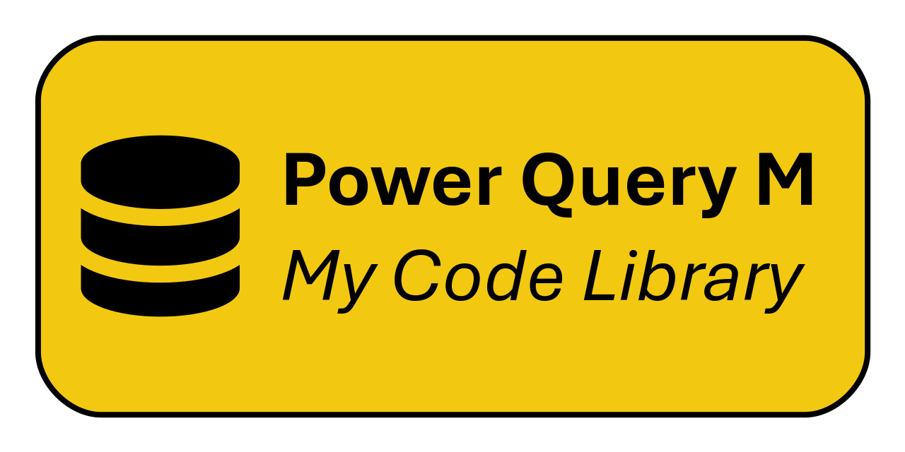

# Power Query M - My Code Library 

## 📖 Overview
My public library of reusable functions, scripts, code snippets, and utilities I have written in PowerQueryM language, adopted in Microsoft Excel (v2016+) and PowerBI; each module is organized into its own folder and includes dedicated documentation.

## 📦 Folder structure
To provide clarity and consistency across the repository:
- **File names:** are designed to reflect the function name;
- **README files:** each folder includes its own *README* describing parameters, output, and usage examples;
- **Code approach:** 
Depending on the complexity of the module, each folder may provide one or more implementation styles:
  - *<ins>Single monolithic file</ins>:* A single, self‑contained file that includes the full logic.
  - *<ins>Modular multi-file</ins>:* The functions are split across multiple files, each stored in its own file. Individual functions can be used independently or combined, with small edits applied where needed.
  - *<ins>Hybrid</ins>:* Both monolithic and modular version are provided. This gives you the flexibility to either import a single file or adopt a multi‑file workflow.
- **Customization:** Regardless of the approach, functions may still require minor adjustments (such as customizing parameters, adapting variables or performing simple copy‑paste integration into your project).

## 📂 Repository
| Folder | Description |
|-|-|
| [Time Table](./Time%20Table) | Generating customizable time-based tables between two datetimes, with a configurable step duration. |
| [Team User Local Folder](./Team%20User%20Local%20Folder) | Managing user‑specific local root-path folders on shared or team‑based cloud-synced machines. |

## ❓ What is Power Query
Power Query is a data transformation and preparation engine used to perform extract, transform and load (ETL) operations across a wide range of data sources through an extensive library of built‑in connectors.[^pqintro]
[^pqintro]: [Language Reference (Microsoft)](https://learn.microsoft.com/en-us/powerquery-m)

## 🔗 Resources
A list of references and tools related to Power Query M development:
| Link | Description |
|-|-|
| **[Official Site (Microsoft)](https://powerquery.microsoft.com)** | Official overview, product information and ecosystem resources. |
| **[Language Reference (Microsoft)](https://learn.microsoft.com/en-us/powerquery-m)** | Official documentation of the M language, including functions, types, and syntax. |
| **[VS Code Extension (Microsoft)](https://github.com/microsoft/vscode-powerquery)** | Official Visual Studio Code extension powered by Microsoft for editing Power Query. |